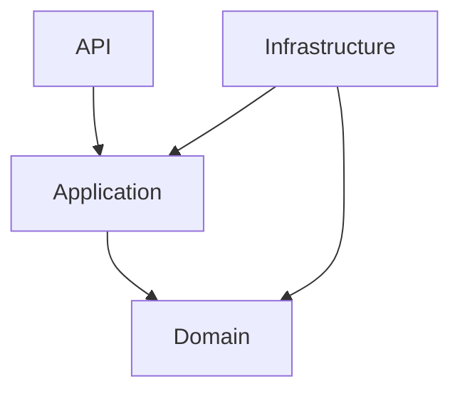
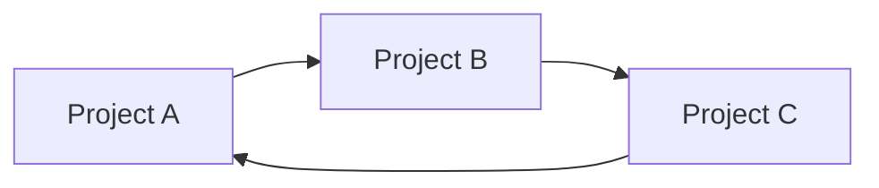

# Dependency Diagram

## What Is It?

A **Dependency Diagram** is a visual representation of how projects, modules, or classes depend on each other.

It helps developers understand project relationships and identify unwanted dependencies without manually inspecting every project reference.

## Example

Consider a .NET solution with four projects:

The arrows represent compile-time dependencies: the project at the start of an arrow depends on the project at its end.

For example, `Application --> Domain` means the Application project references the Domain project.

## When Is It Useful?

* Understanding dependencies in large solutions.
* Identifying unwanted project references.
* Reviewing architectural boundaries.
* Understanding an unfamiliar codebase.
* Planning changes that may affect multiple projects.

For small projects, a separate diagram may not be necessary.

## Common Problem: Dependency Cycles

A dependency cycle occurs when dependencies form a loop.

This can make projects harder to maintain and can prevent compilation when the cycle involves project references.

## Important Distinction

A dependency diagram shows **which components depend on each other**, not necessarily the order in which they execute.

A request flow diagram, by contrast, shows the sequence of steps taken when an operation runs.

## Tools

* [Mermaid Live Editor](https://mermaid.live/) — Create diagrams using text.
* [diagrams.net](https://app.diagrams.net/) — Draw diagrams visually.
* [Visual Studio Code Maps](https://learn.microsoft.com/en-us/visualstudio/modeling/map-dependencies-across-your-solutions?view=visualstudio) — Explore dependencies in supported Visual Studio editions.

## Key Takeaway

Use a Dependency Diagram when visualizing project relationships helps you understand a system, identify unwanted dependencies, or assess the impact of changes. You do not need one for every project.
