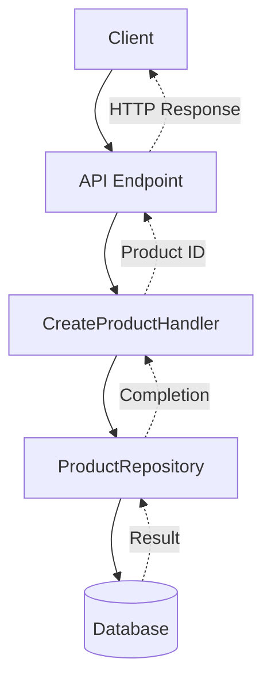
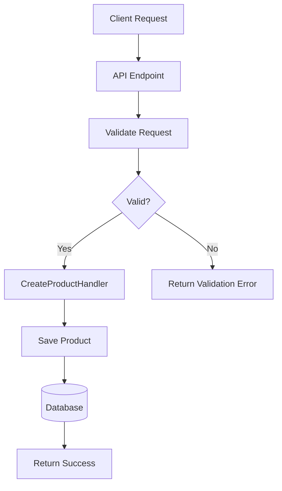
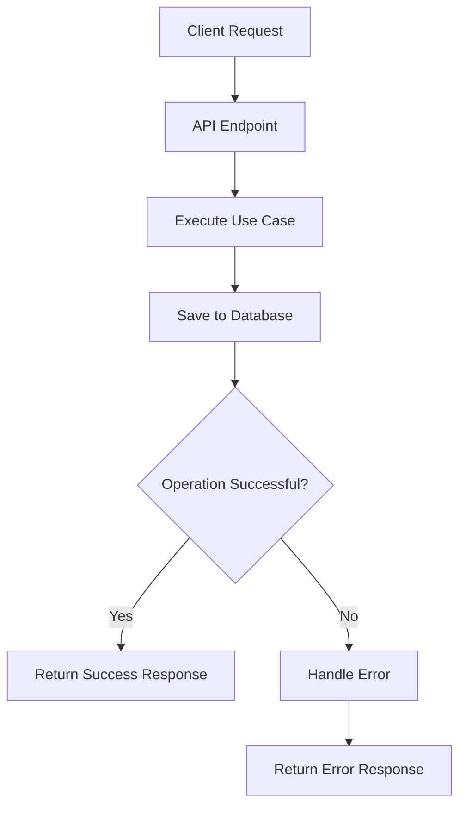

# Request Flow Diagram

## What Is It?

A **Request Flow Diagram** is a visual representation of the steps a request follows through an application, from the initial request to the final response.

It shows the execution order, the components involved, and the possible paths the request can take.

## Why Is It Useful?

- Understand how a specific use case executes.
- Visualize how data moves through the system.
- Identify where validation and error handling occur.
- Troubleshoot complex requests.
- Explain application behavior to other developers.

## 1. Basic Request Flow

Consider a .NET API endpoint that creates a product.

**How to read the diagram:**

1. The client sends an HTTP request.
2. The API endpoint receives the request and invokes the handler.
3. The handler executes the use case.
4. The repository saves the product.
5. The result returns through the call chain.
6. The API sends the HTTP response to the client.

- Solid arrows represent the forward processing flow.
- Dashed arrows represent the return flow.

## 2. Request Flow with Validation

A request may be rejected before any database operation occurs.

This diagram shows a decision point and two possible execution paths.

## 3. Request Flow with Error Handling

A valid request can still fail during processing, for example, because a database operation fails.

Error handling should reflect the application's actual behavior. Validation errors, business failures, and unexpected infrastructure failures may follow different paths.

## 4. When Should You Use It?

- When a use case involves multiple components.
- When a request contains several decision points.
- When investigating where an operation fails.
- When documenting complex business workflows.
- When explaining a feature to other developers.

For simple endpoints, a separate diagram may not be necessary.

## 5. Tools

- [Mermaid Live Editor](https://mermaid.live/) — Create diagrams using text.
- [diagrams.net](https://app.diagrams.net/) — Create diagrams visually.

## Key Takeaway

A Request Flow Diagram shows **what happens, in what order, and what alternative paths are possible when a request is processed**.

Keep each diagram focused on one meaningful use case and ensure it reflects the actual execution flow.